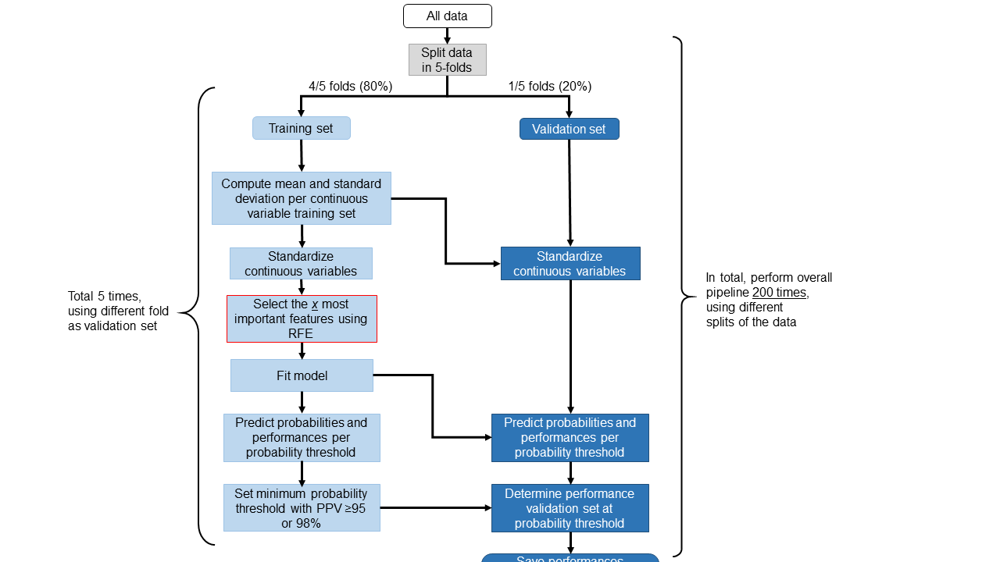

# Lungmarkerstudy_diagnosticalgorithm

Code used in the paper 'Liquid biopsy-based decision support algorithms for diagnosis and subtyping of lung cancer' by Visser et al. 

## General description
In this paper, we used liquid biopsy data to train and validate logistic regression models for identification of **1) lung cancer (LC)**, **2) non-small-cell lung cancer (NSCLC)** and **3) small-cell lung cancer (SCLC)**. Cross-validation was performed to allow for validation of the model on patients who were not used for training of the model, i.e. the validation set. To give better insights in the clinical applicability of these models, the performance of the validation set was evaluated at a probability threshold at which a pre-specified PPV could be achieved in the training set. This pre-specified PPV was 98% for the LC model (1) and 95% for the NSCLC and SCLC models (2 and 3). 

Input data used was: 8 protein tumor markers (TMs) (CA125, CA15.3, CEA, CYFRA 21-1, HE4, NSE, proGRP and SCCA), 2 circulating tumor DNA (ctDNA) markers (concentration of cell-free DNA (wild-type *KRAS*) and ctDNA (no presence of mutation in *KRAS*, *EGFR* or *BRAF* = 0, mutation present = 1), age and sex (male = 0, female = 1). We determined the optimal combination of protein TMs for the 3 different classification tasks using Recursive Feature Elimination (RFE).

Output data used in the 3 different classification tasks were:
1) No LC (class 0) vs. LC (class 1)
2) No NSCLC (= no LC + SCLC) (class 0) vs. NSCLC (class 1)
3) No SCLC (= no LC + NSCLC) (class 0) vs. SCLC (class 1)

*NOTE*: Due to privacy/ethical restrictions, the data used in this paper is not publically available. We added example files with random dummy data (no patient data) to show how the input files should be structured. These input files can be altered using own data.   

## Information code
The code can be used for 2 purposes:

### Training of the models
Training models with the same logistic regression pipeline using own input features: files are stored in the folder *model_training*
  - *Example_data_train_model.xlsx*: An example of the structure of the dataset used to run the Python files. The data shown in this table was randomly generated and is thus no real patient data. For using own data to run the models, use the same structure of the file. 
  - *main_file_training_models.py*: This file can be used to run the logistic regression pipeline. Moreover, this file is used to define the input variables and output variable for the training of the logistic regression models. The definitions of the variables returned by the logistic regression models are described.   
    - The variable *problem* can be changed to define the output variable (lines 27-29) (**LC** of classification problem 1, **NSCLC** for classification problem 2, and **SCLC** for classification problem 3)
    - Line 42 *X = X.loc[:,'...']* can be changed to use a subset of all input variables
    - Line 47 *cnt_var = ['...']* defines the continuous variables and should be adjusted if only a subset of the input variables is used
  - *logistic_regression_pipeline.py*: Training of the logistic regression models, as performed in the paper on the individual markers and using the 'optimal' set of markers. These models were all adjusted for age and sex, by using these variables as input variables as well. The outline of the pipeline can be seen in the Figure below:

  
  
  - *main_file_training_RFE.py*: This file can be used to run the Recursive Feature Elimination procedure for multiple numbers of selected features. The performances per number of selected features can be used to determine the 'optimal' combination of protein TMs. 
      -  Input and output features are defined. 
          - The variable *problem* can be changed to define the output variable (lines 27-29) (**LC** of classification problem 1, **NSCLC** for classification problem 2, and **SCLC** for classification problem 3)
          - Line 42 *X = X.loc[:,'...']* can be changed to use a subset of all input variables
          - Line 47 *cnt_var = ['...']* defines the continuous variables and should be adjusted if only a subset of the input variables is used
      -  A for-loop will be run with multiple numbers of selected features (n_features_to_select) and the performances of these models will be determined. 
      -  Median (IQR) performances per number of selected features are stored in *performance_metrics_table*. 
      -  The percentage that a feature is selected per total number of selected features is plotted. 
  
  - *logistic_regression_pipeline_RFE.py*: This recursive feature elimination pipeline is similar to the previous logistic regression pipeline, except that the x (*n_features_to_select*) most important features will be selected per cross-validation fold. The outline of the pipeline can be seen in the Figure below:
  
    
  
  - *performance_metrics.py*: Determine the performance metrics (sensitivity, specificity, PPV and NPV) at a certain probability threshold
  - *ROC_curve_with_confidence_interval.py*: Determine the average ROC-curve by performing vertical averaging
  

### Model predictions on new patients

  
  
  
- Applying the models from the articles to new patients for predicting of probabilities

## Package versions

- python version 3.8.8
- matplotlib 3.3.4
- pandas 1.2.4
- numpy 1.20.1
- seaborn 0.11.1
- sklearn 0.24.1

